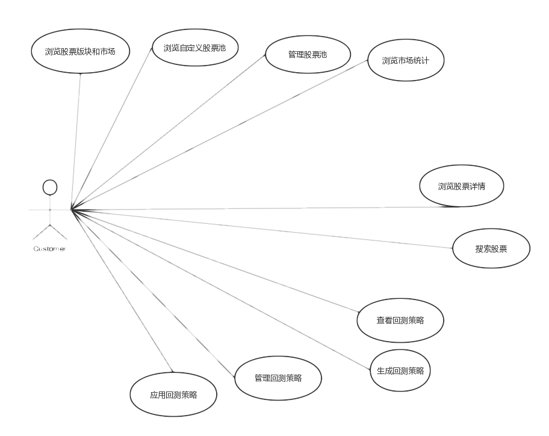

# 软件需求规格说明文档

[TOC]

## 更新历史

| 修改人员 | 日期         | 变更原因     | 版本号        |
| ---- | ---------- | -------- | ---------- |
| 惠晗涛  | 2017.05.28 | 初始版本     | V1.0(Demo) |
| 黄泽鹏  | 2017.06.05 | 完善最后一个用例 | V1.1(Demo) |
| 李晓东  | 2017.06.10 | 检查完善     | V2.0       |

##  一、引言

### 1.1	目的

​	本文档描述了Eureka_Quantour股票交易回测系统的功能需求和非功能需求。开发小组的软件系统实现与验证工作都以此文档为依据

[返回顶部](#软件需求规格说明文档)

### 1.2	范围

​	Eureka_Quantour股票交易回测系统，通过获取市场的每天交易数据(开盘，收盘,最高最低，成交量)，通过用户自己制定交易策略，给出用户比较感兴趣的图表与数据

[返回顶部](#软件需求规格说明文档)

### 1.3	参考文献

​	师生交流系统需求规格说明文档

[返回顶部](#软件需求规格说明文档)

##  二、总体描述

### 2.1	系统功能

通过对股票交易策略的回测于预测，给出用户所感兴趣的数据与图表

[返回顶部](#软件需求规格说明文档)

### 2.2	用户特征

股民或者对股市感兴趣的用户，希望软件能帮助其进行股票交易策略的评估

[返回顶部](#软件需求规格说明文档)

### 2.3	约束

+ CON1:采用Java语言开发

+ CON2:图形化界面进行操作

+ CON3:服务器端中的文件:Server.jar、config要放在同一个目录下

+ CON4:在开发中，开发者要提交软件需求规格说明文档，设计描述文档和测试报

[返回顶部](#软件需求规格说明文档)

### 2.4	假设和依赖

+ AE1:用户能比较熟练操作系统

[返回顶部](#软件需求规格说明文档)

### 2.5 需求

#### 2.5.1 对外接口

用户界面系统应使用Form风格的界面

[返回顶部](#软件需求规格说明文档)

#### 2.5.2 非功能需求

##### 2.5.2.1 安全性

系统允许所有用户访问

[返回顶部](#软件需求规格说明文档)

##### 2.5.2.2 可维护性

系统应该具备可扩展为对其他市场，股票池，策略数据处理的能力

[返回顶部](#软件需求规格说明文档)

##### 2.5.2.3 易用性

新手用户能在一到两天熟悉系统操作(查看股票数据、策略回测)

[返回顶部](#软件需求规格说明文档)

##### 2.5.2.4 性能需求

由于初始化数据较多，一般情况下第一次打开程序可能稍慢

[返回顶部](#软件需求规格说明文档)

#### 2.5.3 数据需求

##### 2.5.3.1 数据存储

所有数据全部存放在云服务数据库中

[返回顶部](#软件需求规格说明文档)

#### 2.5.4 其他需求

无

[返回顶部](#软件需求规格说明文档)

## 三、项目用例描述及整体用例图

### 3.1	项目整体用例图

本系统有一个参与者。

1. 用户：即使用该系统的参与者 

### 3.2项目用例描述

#### 3.2.1浏览股票板块和市场

| 属性       | 内容                                       |
| -------- | ---------------------------------------- |
| 名称       | 浏览股票板块和市场                                |
| 创建者      | 惠晗涛                                      |
| 创建日期     | 2017.05.28                               |
| 最后一次修改者  | 惠晗涛                                      |
| 最后一次修改日期 | 2017.05.28                               |
| 参与者      | 用户                                       |
| 触发条件     | 用户请求浏览股票板块和市场信息                          |
| 前置条件     | 无                                        |
| 后置条件     | 无                                        |
| 优先级      | 高                                        |
| 正常流程     | 1.用户请求浏览股票板块和市场  2.系统显示当天日期所有股票数据。（数据包含最高价，最低价，涨跌幅度，开盘价收盘价） |
| 扩展流程     | 右键某只股票，可以显示三个功能。包括 1.添加股票至股票池 2.在窗口右侧显示股票图表细节 3.跳转至股票详细信息查看页面 |
| 特殊需求     | 1.系统可以将每日的涨幅前10支股票，跌幅前10只股票单独显示 2.若该市场股票数不足10只，则全部显示 3.系统只能显示2006.01.01至当天日期的所有工作日的市场与板块数据 |

##### 3.2.1.1特性描述

用户进行股票板块和市场浏览请求

优先级=高

##### 3.2.1.2刺激响应序列

+ 刺激：用户请求浏览股票板块和市场浏览
+ 响应：系统显示当天日期所有股票数据。（数据包含最高价，最低价，涨跌幅度，开盘价收盘价）
+ 刺激：用户查询非工作日股票板块和市场数据
+ 响应：提示用户输入日期有误，请求重新输入
+ 刺激：用户查询日期过早，或着晚于当天日期
+ 响应：提示用户输入日期有误，请求重新输入

##### 3.2.1.3相关功能需求

| 功能                      | 描述                        |
| ----------------------- | ------------------------- |
| Market.Get              | 系统允许用户查看当天日期所有股票数据        |
| Market.GetTop10         | 系统允许用户查看当天日期涨幅前十股票数据      |
| Market.GetBottom10      | 系统允许用户查看当天日期涨幅后十股票数据      |
| Market.Error.NonWeekDay | 用户查询非工作日数据，系统报错           |
| Market.Error.TooEarly   | 用户查询2006.01.01.以前的数据，系统报错 |
| Market.Error.TooLate    | 用户查询今天以后的数据，系统报错          |

[返回顶部](#软件需求规格说明文档)

#### 3.2.2浏览自定义股票池

| 属性       | 内容                                       |
| -------- | ---------------------------------------- |
| 名称       | 浏览自定义股票池                                 |
| 创建者      | 惠晗涛                                      |
| 创建日期     | 2017.06.01                               |
| 最后一次修改者  | 惠晗涛                                      |
| 最后一次修改日期 | 2017.06.01                               |
| 参与者      | 用户                                       |
| 触发条件     | 用户查看自定义股票池                               |
| 前置条件     | 用户已经拥有自己定义的股票池                           |
| 后置条件     | 无                                        |
| 优先级      | 高                                        |
| 正常流程     | 1.用户选择浏览股票池 2.系统显示用户所有拥有的股票池列表 3.用户点击某一个股票池，系统显示该股票池中今日所有的股票数据 |
| 扩展流程     | 1.用户没有股票池，系统提示用户没有，并且打开一个空界面 2.用户股票池中无数据，系统提示用户股票池中没有数据，并且在数据显示页面，显示为空 |
| 特殊需求     | 1.系统显示的股票数据按照今日的涨跌幅排序                 |

##### 3.2.2.1特性描述

用户查看自定义的股票池

优先级=高

##### 3.2.2.2刺激响应序列

+ 刺激：用户请求查看自己的股票池列表
+ 响应：系统显示用户所有的自定义股票池列表
+ 刺激：用户点击股票池中的某一个股票池
+ 响应：系统显示该股票池中的所有股票数据
+ 刺激：用户结束股票池信息查看
+ 相应：系统退回初始界面

##### 3.2.2.3相关功能需求

| 功能                    | 描述                 |
| --------------------- | ------------------ |
| StockSet.Get          | 系统显示用户所有的股票池       |
| StockSet.Stock.Get    | 系统显示股票池中用户选定的股票的数据 |
| StockSet.Stock.Delete | 系统允许用户删除股票池中的某只股票  |
| StockSet.End          | 系统退回初始界面           |

[返回顶部](#软件需求规格说明文档)

#### 3.2.3管理股票池

| 属性       | 内容                                       |
| -------- | ---------------------------------------- |
| 名称       | 管理股票池                                    |
| 创建者      | 惠晗涛                                      |
| 创建日期     | 2017.05.28                               |
| 最后一次修改者  | 惠晗涛                                      |
| 最后一次修改日期 | 2017.05.28                               |
| 参与者      | 用户                                       |
| 触发条件     | 用户请求管理自定义股票池                             |
| 前置条件     | 无                                        |
| 后置条件     | 系统修改用户自定义股票池信息                           |
| 优先级      | 高                                        |
| 正常流程     | 新建： 1.用户新建股票池 2.系统允许用户输入股票池名称 删除： 1.用户选定股票池，并删除该股票池 2.系统删除该股票池 |
| 扩展流程     | 1.用户添加股票名称重复，系统提示异常，并请求用户重新输入            |
| 特殊需求     | 无                                        |

##### 3.2.3.1特性描述

用户管理自定义的股票池

优先级=高

##### 3.2.3.2刺激响应序列

+ 刺激：用户新建股票池
+ 响应：系统要求用户输入股票池明称
+ 刺激：用户输入股票池明称
+ 响应：系统为用户创建响应股票池
+ 刺激：用户输入已经存在的股票池明称
+ 响应：系统提示异常，并请求用户重新输入股票池明称
+ 刺激：用户删除选定股票池
+ 响应：系统删除用户选定的股票池

##### 3.2.3.3相关功能需求

| 功能                        | 描述                  |
| ------------------------- | ------------------- |
| StockSet.New              | 系统新建股票池             |
| StockSet.Error.NameRepeat | 系统检测到用户输入股票池名称称重复异常 |
| StockSet.New.Input        | 系统允许用户输入新建股票池明称     |
| StockSet.Delete           | 系统删除用户选定股票池         |
| StockSet.End              | 系统退回初始界面            |

[返回顶部](#软件需求规格说明文档)

#### 3.2.4浏览市场统计

| 属性       | 内容                                       |
| -------- | ---------------------------------------- |
| 名称       | 浏览市场统计                                   |
| 创建者      | 惠晗涛                                      |
| 创建日期     | 2017.05.28                               |
| 最后一次修改者  | 惠晗涛                                      |
| 最后一次修改日期 | 2017.05.28                               |
| 参与者      | 用户                                       |
| 触发条件     | 用户请求查看市场统计                               |
| 前置条件     | 当天为工作日                                   |
| 后置条件     | 无                                        |
| 优先级      | 高                                        |
| 正常流程     | 1.用户请求浏览改天市场统计 2.用户选择特定的市场 3.系统显示该天的市场的统计数据 |
| 扩展流程     | 1.该天为非交易日，系统提示异常，请求用户更新日期                |
| 特殊需求     | 无                                        |

##### 3.2.4.1特性描述

用户请求浏览市场统计

优先级=高

##### 3.2.4.2刺激响应序列

+ 刺激：用户请求查看市场统计数据
+ 响应：系统要求用户选定市场
+ 刺激：用户查看该市场的数据
+ 响应：系统显示该天该市场的统计数据
+ 刺激：用户查询非交易日数据
+ 响应：系统提示异常，并要求用户重新输入

##### 3.2.4.3相关功能需求

| 功能                      | 描述                  |
| ----------------------- | ------------------- |
| Market.Select           | 系统允许用户选择股票市场        |
| Market.Show             | 系统显示用户选定的市场的统计数据    |
| Market.Error.NonWorkDay | 系统提示用户输入日期有误，要求重新输入 |
| Market.End              | 系统退回初始界面            |

[返回顶部](#软件需求规格说明文档)

#### 3.2.5浏览股票详情

| 属性       | 内容                                       |
| -------- | ---------------------------------------- |
| 名称       | 浏览股票详情                                   |
| 创建者      | 惠晗涛                                      |
| 创建日期     | 2017.05.28                               |
| 最后一次修改者  | 惠晗涛                                      |
| 最后一次修改日期 | 2017.05.28                               |
| 参与者      | 用户                                       |
| 触发条件     | 用户请求查看特定股票的详细信息                          |
| 前置条件     | 用户选择查看市场，板块信息，或股票池信息                     |
| 后置条件     | 无                                        |
| 优先级      | 高                                        |
| 正常流程     | 1.用户选择查看股票的详细信息 2.系统跳转至股票的详细信息界面 3.系统显示选定股票的之前100日的k线图，均线图 |
| 扩展流程     | 1.用户可以在此将股票添加只某只股票池 2.用户查看的股票当日无数据，系统提示异常 |
| 浏览市场统计   | 无                                        |

##### 3.2.5.1特性描述

用户浏览股票详情

优先级=高

##### 3.2.5.2刺激响应序列

+ 刺激：用户右键选择特定股票
+ 响应：系统显示功能列表
+ 刺激：用户点击详细
+ 响应：系统跳转至查看股票详细信息界面，并且加载股票数据
+ 刺激：用户选择非工作日的股票查看
+ 响应：系统显示为空界面，并且提醒用户

##### 3.2.5.3相关功能需求

| 功能                 | 描述              |
| ------------------ | --------------- |
| Stock.Select       | 系统显示股票的功能列表     |
| Stock.ShowInfo     | 系统显示股票的详细信息     |
| Stock.Error.NoData | 系统提示用户输入日期无股票信息 |
| Stock.End          | 系统退回初始界面        |

[返回顶部](#软件需求规格说明文档)

#### 3.2.6搜索股票

| 属性       | 内容                                       |
| -------- | ---------------------------------------- |
| 名称       | 搜索股票                                     |
| 创建者      | 惠晗涛                                      |
| 创建日期     | 2017.05.28                               |
| 最后一次修改者  | 惠晗涛                                      |
| 最后一次修改日期 | 2017.05.28                               |
| 参与者      | 用户                                       |
| 触发条件     | 用户请求搜索某只股票                               |
| 前置条件     | 无                                        |
| 后置条件     | 显示股票改日的数据信息                              |
| 优先级      | 高                                        |
| 正常流程     | 1.用户输入搜索内容 2.系统提示用户可以搜索的结果 3.用户选定股票 4.系统显示用户选定的股票详细信息 |
| 扩展流程     | 1.用户输入错误信息，系统提示用户输入有误，并请求重新输入            |
| 特殊需求     | 1.支持模糊搜索 2.同时支持用户输入股票编码或股票名称          |

##### 3.2.6.1特性描述

用户搜索股票

优先级=高

##### 3.2.6.2刺激响应序列

+ 刺激：用户输入搜索内容
+ 响应：系统显示和输入内容有关的搜索结果
+ 刺激：用户确定输入内容
+ 响应：系统显示用户输入股票编号的股票信息
+ 刺激：用户输入错误内容
+ 响应：系统提示无匹配内容，并要求用户重新输入

##### 3.2.6.3相关功能需求

| 功能                   | 描述                      |
| -------------------- | ----------------------- |
| Search.Input         | 系统允许用户输入信息              |
| Search.Fuzzy         | 系统根据用户输入内容，进行模糊搜索检索     |
| Search.Select        | 系统根据用户输入内容，显示相关的股票数据    |
| Search.Error.invalid | 系统提示用户没有和输入匹配的内容，请求重新输入 |
| Search.End           | 系统退回至初始界面               |

[返回顶部](#软件需求规格说明文档)

#### 3.2.7查看回测策略

| 属性       | 内容                                       |
| -------- | ---------------------------------------- |
| 名称       | 查看回测策略                                   |
| 创建者      | 惠晗涛                                      |
| 创建日期     | 2017.05.28                               |
| 最后一次修改者  | 惠晗涛                                      |
| 最后一次修改日期 | 2017.05.28                               |
| 参与者      | 用户                                       |
| 触发条件     | 用户请求查看某个回测策略                             |
| 前置条件     | 无                                        |
| 后置条件     | 显示该策略的计算结果                               |
| 优先级      | 高                                        |
| 正常流程     | 1.用户选择策略所需要的股票池 2.用户选择策略的生成条件 3.系统计算该策略，显示出收益率图表与相关参数 |
| 扩展流程     | 1.用户输入前后日期冲突，系统提示异常，要求用户重新输入日期 2.用户选择无数据的股票池，系统提示异常，并请求更换股票池  |
| 特殊需求     | 1.包括动量策略，均值策略等 2.生成图表包括策略收益率对比曲线，收益率分布直方图 |

##### 3.2.7.1特性描述

用户查看回测策略

优先级=高

##### 3.2.7.2刺激响应序列

+ 刺激：用户选择股票池
+ 响应：系统列出所有的默认股票池与用户自定义的股票池
+ 刺激：用户输入参数，点击生成策略
+ 响应：系统计算策略，给出策略图表与相关参数
+ 刺激：用户输入前后日期冲突
+ 响应：系统提示异常，并请求重新输入
+ 刺激：用户输入参数不全
+ 响应：系统提示用户输入参数不全，请求输入完整

##### 3.2.7.3相关功能需求

| 功能                           | 描述               |
| ---------------------------- | ---------------- |
| Strategy.StockSet.Set        | 系统允许用户选择策略对应的股票池 |
| Strategy.Input               | 系统允许用户输入策略参数     |
| Strategy.Error.Date          | 系统提示用户输入日期异常     |
| Strategy.Error.ParameterMiss | 系统提示用户输入参数不全异常   |
| Strategy.Show                | 系统显示策略计算结果       |
| Strategy.Calculate           | 系统根据输入参数进行策略计算   |
| Strategy.End                 | 系统退回初始界面         |

[返回顶部](#软件需求规格说明文档)

#### 3.2.8管理回测策略

| 属性       | 内容                                       |
| -------- | ---------------------------------------- |
| 名称       | 管理回测策略                                   |
| 创建者      | 惠晗涛                                      |
| 创建日期     | 2017.05.28                               |
| 最后一次修改者  | 惠晗涛                                      |
| 最后一次修改日期 | 2017.05.28                               |
| 参与者      | 用户                                       |
| 触发条件     | 用户请求管理自己的回测策略                            |
| 前置条件     | 无                                        |
| 后置条件     | 无                                        |
| 优先级      | 高                                        |
| 正常流程     | 1.用户请求查看自己的策略列表 2.系统显示用户所制定过的所有策略 3.用户可以设置自己的策略公开属性 4.系统更改策略公开属性 5.用户删除某个选定的策略 6.系统删除用户相关策略 |
| 扩展流程     | 无                                        |
| 特殊需求     | 无                                        |

##### 3.2.8.1特性描述

用户管理回测策略

优先级=高

##### 3.2.8.2刺激响应序列

+ 刺激：用户请求查看自己的策略列表
+ 响应：系统显示用户的所有策略列表
+ 刺激：用户请求修改自己的策略公开属性
+ 响应：系统修改用户策略公开属性
+ 刺激：用户请求删除某个策略
+ 响应：系统删除该策略

##### 3.2.8.3相关功能需求

| 功能                     | 描述           |
| ---------------------- | ------------ |
| Strategy.Manage.Show   | 系统显示用户的所有策略  |
| Strategy.Manage.Update | 系统修改用户策略公开属性 |
| Strategy.Manage.Delete | 系统删除用户策略     |
| Strategy.Manage.End    | 系统退回初始界面     |

[返回顶部](#软件需求规格说明文档)

#### 3.2.9应用回测策略

| 属性       | 内容                                       |
| -------- | ---------------------------------------- |
| 名称       | 应用回测策略                                   |
| 创建者      | 黄泽鹏                                      |
| 创建日期     | 2017.06.05                               |
| 最后一次修改者  | 黄泽鹏                                      |
| 最后一次修改日期 | 2017.06.05                               |
| 参与者      | 用户                                       |
| 触发条件     | 用户请求应用某个回测策略                             |
| 前置条件     | 无                                        |
| 后置条件     | 显示该策略的计算结果                               |
| 优先级      | 高                                        |
| 正常流程     | 1.用户选择浏览别人的某一策略 2.用户选择“应用策略” 3.系统将策略参数填入生成策略 4.用户选择股票池并应用策略 5.系统显示策略运行结果 |
| 扩展流程     | 无                                        |
| 特殊需求     | 1.策略可以是用户自定义的策略 2.股票池默认为“沪深300”       |

##### 3.2.9.1特性描述

用户应用回测策略

优先级=高

##### 3.2.9.2刺激响应序列

+ 刺激：用户查看别人某一策略
+ 响应：系统显示该策略的各个参数
+ 刺激：用户在查看别人策略时选择应用策略参数
+ 响应：系统自动将策略参数填入生成策略
+ 刺激：用户选择股票池
+ 响应：系统显示已选股票池
+ 刺激：用户选择应用策略
+ 响应：系统显示根据最近数据策略运行结果

##### 3.2.9.3相关功能需求

| 功能                      | 描述             |
| :---------------------- | :------------- |
| Strategy.Input          | 策略运用时允许用户输入    |
| Strategy.Input.StockSet | 策略运用时允许用户选择股票池 |
| Strategy.Input.Apply    | 用户运用某一策略参数     |
| Strategy.Show           | 用户查看某一策略       |
| Strategy.Apply          | 用户运用该策略        |
| Strategy.Apply.Show     | 系统显示策略运用结果     |

[返回顶部](#软件需求规格说明文档)