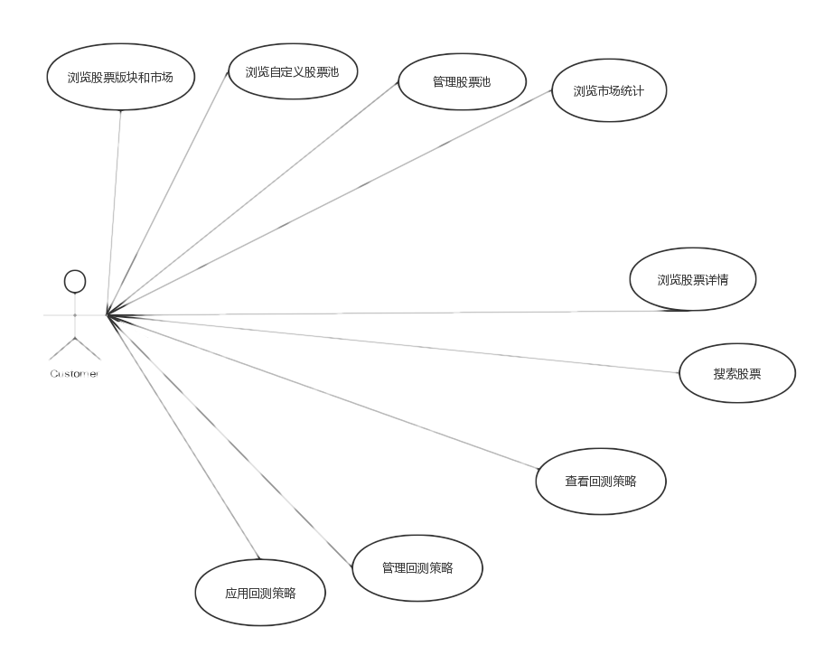

# 软件需求规格说明文档

[TOC]

## 更新历史

| 修改人员 | 日期         | 变更原因 | 版本号        |
| ---- | ---------- | ---- | ---------- |
| 惠晗涛  | 2017.05.28 | 初始版本 | V1.0（demo） |
|      |            |      |            |
|      |            |      |            |

##  一、引言

### 1.1	目的

​	本文档描述了Eureka_Quantour股票交易回测系统的功能需求和非功能需求。开发小组的软件系统实现与验证工作都以此文档为依据

### 1.2	范围

​	Eureka_Quantour股票交易回测系统，通过获取市场的每天交易数据(开盘，收盘,最高最低，成交量)，通过用户自己制定交易策略，给出用户比较感兴趣的图表与数据

### 1.3	参考文献

​	师生交流系统需求规格说明文档

##  二、总体描述

### 2.1	系统功能

通过对股票交易策略的回测于预测，给出用户所感兴趣的数据与图表

### 2.2	用户特征

股民或者对股市感兴趣的用户，希望软件能帮助其进行股票交易策略的评估

### 2.3	约束

+ CON1:采用Java语言开发

+ CON2:图形化界面进行操作

+ CON3:服务器端中的文件:Server.jar、config要放在同一个目录下

+ CON4:在开发中，开发者要提交软件需求规格说明文档，设计描述文档和测试报

### 2.4	假设和依赖

+ AE1:用户能比较熟练操作系统

### 2.5 需求

#### 2.5.1 对外接口

用户界面系统应使用Form风格的界面

#### 2.5.2 非功能需求

##### 2.5.2.1 安全性

系统允许所有用户访问

##### 2.5.2.2 可维护性

系统应该具备可扩展为对其他市场，股票池，策略数据处理的能力

##### 2.5.2.3 易用性

新手用户能在一到两天熟悉系统操作(查看股票数据、策略回测)

##### 2.5.2.4 性能需求

由于初始化数据较多，一般情况下第一次打开程序可能稍慢

#### 2.5.3 数据需求

##### 2.5.3.1 数据存储

所有数据全部存放在云服务数据库中

#### 2.5.4 其他需求

无

## 三、项目用例描述及整体用例图

### 3.1	项目整体用例图

本系统有一个参与者。

1. 用户：即使用该系统的参与者 

 ### 3.2项目用例描述

 #### 3.2.1浏览股票板块和市场

| 属性       | 内容                                       |
| -------- | ---------------------------------------- |
| 名称       | 浏览股票板块和市场                                |
| 创建者      | 惠晗涛                                      |
| 创建日期     | 2017.05.28                               |
| 最后一次修改者  | 惠晗涛                                      |
| 最后一次修改日期 | 2017.05.28                               |
| 参与者      | 用户                                       |
| 触发条件     | 用户请求浏览股票板块和市场信息                          |
| 前置条件     | 无                                        |
| 后置条件     | 无                                        |
| 优先级      | 高                                        |
| 正常流程     | 1.用户请求浏览股票板块和市场  2.系统显示当天日期所有股票数据。（数据包含最高价，最低价，涨跌幅度，开盘价收盘价） |
| 扩展流程     | 右键某只股票，可以显示三个功能。包括 1.添加股票至股票池 2.在窗口右侧显示股票图表细节 3.跳转至股票详细信息查看页面 |
| 特殊需求     | 1.系统可以将每日的涨幅前10支股票，跌幅前10只股票单独显示 2.若该市场股票数不足10只，则全部显示 3.系统只能显示2006.01.01至当天日期的所有工作日的市场与板块数据 |

##### 3.2.1.1特性描述

用户进行股票板块和市场浏览请求

优先级=高

##### 3.2.1.2刺激／响应序列

+ 刺激：用户请求浏览股票板块和市场浏览
+ 响应：系统显示当天日期所有股票数据。（数据包含最高价，最低价，涨跌幅度，开盘价收盘价）
+ 刺激：用户查询非工作日股票板块和市场数据
+ 响应：提示用户输入日期有误，请求重新输入
+ 刺激：用户查询日期过早，或着晚于当天日期
+ 响应：提示用户输入日期有误，请求重新输入

##### 3.2.1.3相关功能需求

| 功能                      | 描述                        |
| ----------------------- | ------------------------- |
| Market.Get              | 系统允许用户查看当天日期所有股票数据        |
| Market.GetTop10         | 系统允许用户查看当天日期涨幅前十股票数据      |
| Market.GetBottom10      | 系统允许用户查看当天日期涨幅后十股票数据      |
| Market.Error.NonWeekDay | 用户查询非工作日数据，系统报错           |
| Market.Error.TooEarly   | 用户查询2006.01.01.以前的数据，系统报错 |
| Market.Error.TooLate    | 用户查询今天以后的数据，系统报错          |

#### 3.2.2浏览自定义股票池

| 属性       | 内容                                       |
| -------- | ---------------------------------------- |
| 名称       | 浏览自定义股票池                                 |
| 创建者      | 惠晗涛                                      |
| 创建日期     | 2017.06.01                               |
| 最后一次修改者  | 惠晗涛                                      |
| 最后一次修改日期 | 2017.06.01                               |
| 参与者      | 用户                                       |
| 触发条件     | 用户查看自定义股票池                               |
| 前置条件     | 用户已经拥有自己定义的股票池                           |
| 后置条件     | 无                                        |
| 优先级      | 高                                        |
| 正常流程     | 1.用户选择浏览股票池 2.系统显示用户所有拥有的股票池列表 3.用户点击某一个股票池，系统显示该股票池中今日所有的股票数据 |
| 扩展流程     | 1.用户没有股票池，系统提示用户没有，并且打开一个空界面 2.用户股票池中无数据，系统提示用户股票池中没有数据，并且在数据显示页面，显示为空 |
| 特殊需求     | 1.系统显示的股票数据按照今日的涨跌幅排序                 |

##### 3.2.2.1特性描述

用户查看自定义的股票池

优先级=高

##### 3.2.2.2刺激响应序列

+ 刺激：用户请求查看自己的股票池列表
+ 响应：系统显示用户所有的自定义股票池列表
+ 刺激：用户点击股票池中的某一个股票池
+ 响应：系统显示该股票池中的所有股票数据
+ 刺激：用户结束股票池信息查看
+ 相应：系统退回初始界面

##### 3.2.2.3相关功能需求

| 功能                 | 描述                 |
| ------------------ | ------------------ |
| StockSet.Get       | 系统显示用户所有的股票池       |
| StockSet.Stock.Get | 系统显示股票池中用户选定的股票的数据 |
|                    |                    |
|                    |                    |
|                    |                    |
|                    |                    |
|                    |                    |
|                    |                    |
|                    |                    |

#### 3.2.3管理股票池

| 属性       | 内容             |
| -------- | -------------- |
| 名称       | 管理股票池          |
| 创建者      | 惠晗涛            |
| 创建日期     | 2017.05.28     |
| 最后一次修改者  | 惠晗涛            |
| 最后一次修改日期 | 2017.05.28     |
| 参与者      | 用户             |
| 触发条件     | 用户请求管理自定义股票池   |
| 前置条件     | 无              |
| 后置条件     | 系统修改用户自定义股票池信息 |
| 优先级      | 高              |
| 正常流程     | 1.用户           |
| 扩展流程     |                |
| 特殊需求     |                |

#### 3.2.4浏览市场统计

#### 3.2.5浏览股票详情

#### 3.2.6搜索股票

#### 3.2.7查看回测策略

#### 3.2.8生成回测策略

#### 3.2.9管理回测策略

#### 3.2.10应用回测策略